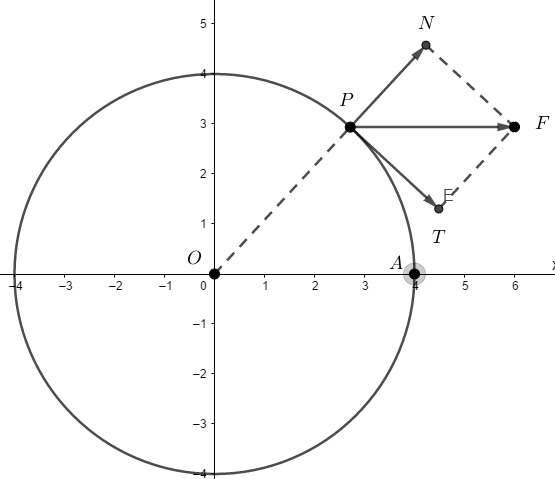

# El Teorema de Valor Medio
## Resumen
Dada una funcion 
 continua en [a,b] y  
diferenciable en <a,b>.
## Introducción
### Listas no numeradas
- uno
- dos
- tres
  * cuatro
### Listas numeradas
1. uno
2. dos
3. tres
   4. cuatro

### Resultados previos

**Aqui se muestra una imagen**

*Este es otro tipo de fuente*



#### Presentación de tablas

| Primer encabezado | Segundo encabezado |
| ------------- | ------------- |
| Contenido de la celda  | Contenido de la celda  |
| Contenido de la celda  | Contenido de la celda  |

#### Código fuente

```C
function test() {
  console.log("notice the blank line before this function?");
}
```
#### Enlace
Este sitio se construyó usando [GitHub Pages](https://pages.github.com/).

#### Texto matemático
5
